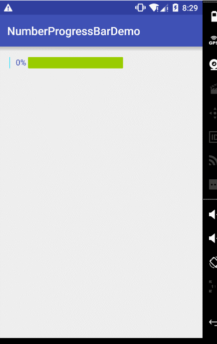

###ProgressBarWithNumbe
仿照[代码家](https://github.com/daimajia/NumberProgressBar)的NumberProgressBar


使用方法：
```xml
 <com.yuan.library.MyProgressBar
        android:id="@+id/number_progress_bar"
        android:layout_width="200dp"
        android:layout_height="wrap_content"
        android:layout_marginLeft="20dp"
        android:layout_marginTop="18dp"
        app:arc="3"
        app:bar_Height="20dp"
        app:reach_Color="@android:color/holo_blue_bright"
        app:textColor="@color/colorPrimary"
        app:textSize="14sp"
        app:unReach_Color="@android:color/holo_green_light" />
```
```java
bar = (ProgressBarWithNumber) findViewById(R.id.number_progress_bar);
bar.setMaxValue(150);
bar.setProgress(i);
```

